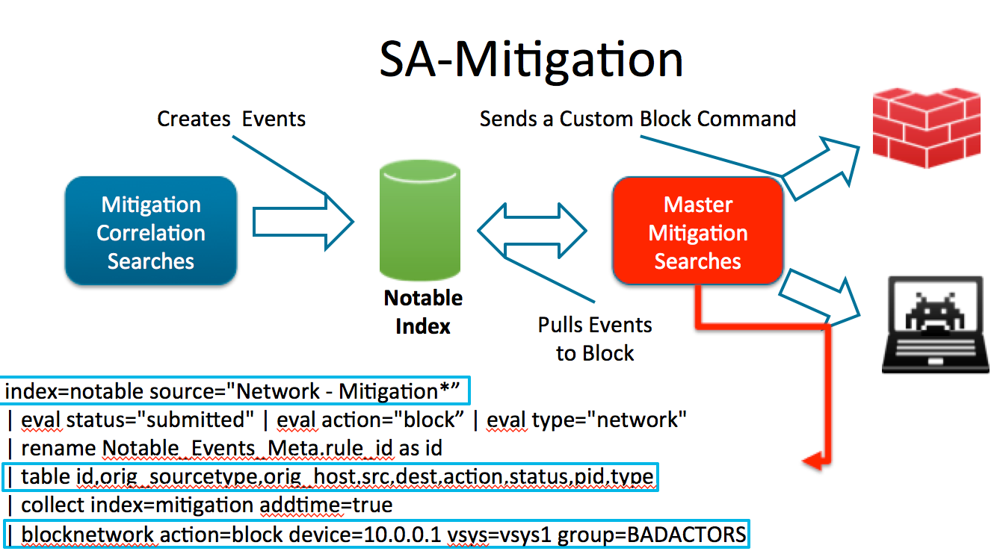

Splunk Mitigation Framework
===========================

## TODOs
* setup.xml
* documentation
* error handling for the endpoint component

## Presentation Content
[Slides](prezo/confPrezo.pptx) 
[Demo Video](prezo/Auto Mitigation - Endpoint Example.mp4)

## Installation
Primariy package is the SA-Mitigation which contains a setup function with instructions on what to configure to get the framework setup.

### SA-Mitigation (Search Head Component)
Contains all the search logic and the custom commands to take action.

#### Search Architecture

#### Installation Instructions
coming soon...

### SA-LWF-Mitigator Endpoint Component

#### Endpoing component architecture 

#### Installation Instructions
comin soon...

